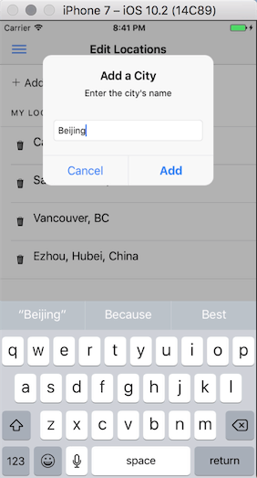

Ionic 2 Weather App
=====================




## start new project
ionic start Ionic2Weather sidemenu --v2

或
```bash
ionic start Ionic2Weather https://github.com/chrisgriffith/Ionic2Weather --v2
```

## Emulate on iOS

List available ios targets: 
```bash
ios-sim showdevicetypes
```

Emulate: 
```bash
ionic emulate ios -l -c --target="iPhone-7, 10.2"
ionic emulate ios -l -c --target="iPhone-7-Plus, 10.2"
```
其中-c(--consolelogs)将日志直接打印到terminal, -l(--livereload)支持保存刷新

details see my blog: https://github.com/uniquejava/blog/issues/42


## 侧边的menu
在app.html定义
```html
<ion-menu [content]="content">
  <ion-header>
    <ion-toolbar>
      <ion-title>Ionic Weather</ion-title>
    </ion-toolbar>
  </ion-header>

  <ion-content>
    <ion-list>
      <button menuClose ion-item *ngFor="let p of pages" (click)="openPage(p)">
        <ion-icon name="{{ p.icon }}"></ion-icon> {{p.title}}
      </button>
    </ion-list>

    <p padding><a href="https://darksky.net/poweredby/">Powered by Dark Sky</a></p>
  </ion-content>

</ion-menu>

<!-- Disable swipe-to-go-back because it's poor UX to combine STGB with side menus -->
<ion-nav [root]="rootPage" #content swipeBackEnabled="false"></ion-nav>
```
其中的openPage在app.component.ts中实现
```js
import {Component, ViewChild} from '@angular/core';
import {Nav, Platform, Events} from 'ionic-angular';
import {StatusBar, Splashscreen} from 'ionic-native';

import {WeatherPage} from '../pages/weather/weather';
import {LocationsPage} from '../pages/locations/locations';
import {WeatherService} from "../providers/weather-service";
import {WeatherLocation} from "../interfaces/weather-location";
import {LocationsService} from '../providers/locations-service';

@Component({
  templateUrl: 'app.html'
})
export class MyApp {
  @ViewChild(Nav) nav: Nav;

  rootPage: any = WeatherPage;

  pages: Array<WeatherLocation>;

  constructor(public platform: Platform, public weatherService: WeatherService, public locationsService: LocationsService, public events: Events) {
    this.initializeApp();

    this.getMyLocations();

  }

  initializeApp() {
    this.platform.ready().then(() => {
      // Okay, so the platform is ready and our plugins are available.
      // Here you can do any higher level native things you might need.
      StatusBar.styleDefault();
      Splashscreen.hide();
    });
  }

  openPage(page) {
    // Reset the content nav to have just this page
    // we wouldn't want the back button to show in this scenario
    if (page.hasOwnProperty('loc')) {
      this.nav.setRoot(page.component, {geoloc: page.loc, title: page.title});
    } else {
      this.nav.setRoot(page.component);
    }

  }

  private getMyLocations() {
    this.locationsService.locations$.subscribe((locs: Array<WeatherLocation>) => {
      this.pages = [
        {title: 'Edit Locations', component: LocationsPage, icon: 'create'},
        {title: 'Current Location', component: WeatherPage, icon: 'pin'}
      ];
      for (let newLoc of locs) {
        this.pages.push(newLoc);
      }
    });
  }

}

```
## 下拉刷新
页面:
```html
<ion-refresher (ionRefresh)="doRefresh($event)">
  <ion-refresher-content pullingIcon="arrow-dropdown" pullingText="Pull to refresh" refreshingSpinner="circles" refreshingText="Refreshing">
  </ion-refresher-content>
</ion-refresher>
```
实现: (待整理)
```js
doRefresh(refresher) {
  var interval = Date.now() - (this.currentLoc.timestamp || 0);
  console.log("ellipse time: ", interval / 1000, 's');
  if (interval > 10000) {
    this.weatherService.getWeather(this.currentLoc).then(theResult => {
      this.theWeather = theResult;
      this.currentData = this.theWeather.currently;
      this.daily = this.theWeather.daily;
      this.currentLoc.timestamp = Date.now();
      refresher.complete();
    });
  } else {
    console.log('no refresh');
    refresher.complete();
  }
}
```

## Observable to promise 
see weather-service.ts
```js
load(currentLoc: CurrentLoc) {
  if (this.data) {
    return Promise.resolve(this.data);
  }
  let requestUrl = '/api/forecast/' + currentLoc.lat + ',' + currentLoc.lon;
  return new Promise((resolve, reject) => {
    this.http.get(requestUrl)
      .timeout(5000)
      // .catch(e => {
      //   if (e.name === "TimeoutError") Observable.throw("Timeout has occurred");
      //   return Observable.throw(e);
      // })
      .map(res => res.json())
      .subscribe(
        data => {
          this.data = data;
          resolve(this.data);
        },
        error => {
          console.log("catch some error in observable.", error); // error
          reject(error);
        },
        () => console.log('yay') // success
      );
  })
}

```
see [How to catch exception correctly from http.request()?][1]
and [Angular 2 Http timeout][2]

## Pages and Providers and Pipeline
```bash
➜ ionic g page weather
➜ ionic g page locations
➜ ionic g provider WeatherService
➜ ionic g provider GeocodeService
➜ ionic g pipeline celsius


```
### Elvis operator (a?.b)
angular2不支持optional数组, 仅支持最基本的比如`a.b?.c`,不支持`a.b?[0].c`

Code
```html
<ion-col width-33>
  {{daily.data[0].temperatureMax | number:'.0-0'}}<br>
  {{daily.data[0].temperatureMin | number:'.0-0'}}
</ion-col>

```
Error:
```
Runtime Error
Error in ./WeatherPage class WeatherPage - inline template:21:24 
caused by: Cannot read property '0' of undefined

```


Solution:

```html
{{ daily.data ? (daily.data[0].temperatureMax | number: '.0-0') : '' }}<br>
```

或者加上 `<ion-grid *ngIf="daily.data != undefined">`


see [here in stackoverflow][3]

##  3rd Party Services

#### 1. Darksky service

Register: https://darksky.net/dev/register

Usage: https://api.darksky.net/forecast/APIKEY/LATITUDE,LONGITUDE

Fix CORS issue in ionic2:
```json
{
  "name": "ionic2-app-base",
  "app_id": "",
  "typescript": true,
  "v2": true,
  "proxies": [
    {
      "path": "/api/forecast",
      "proxyUrl": "https://api.darksky.net/forecast/YOUR_API_KEY"
    }
  ]
}

```

#### 2. Google Geocode service 
Request APIKEY:
https://developers.google.com/maps/documentation/geocoding/get-api-key


[1]:http://stackoverflow.com/questions/35326689/how-to-catch-exception-correctly-from-http-request
[2]:http://stackoverflow.com/questions/41465687/angular-2-http-timeout
[3]:http://stackoverflow.com/questions/35768768/angular2-using-elvis-operator-on-object-key-with-forward-slash?rq=1
