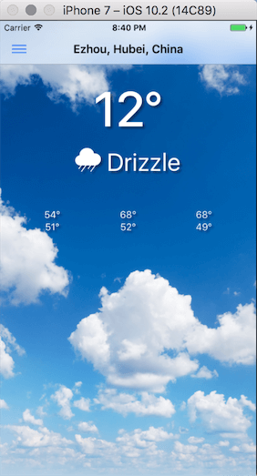

Ionic 2 Weather App
=====================




## Run

List available ios targets: 
```bash
ios-sim showdevicetypes
```

Emulate: 
```bash
ionic emulate ios -l -c --target="iPhone-7, 10.2"
ionic emulate ios -l -c --target="iPhone-7-Plus, 10.2"
```
其中-c(--consolelogs)将日志直接打印到terminal, -l(--livereload)支持保存刷新

## Observable to promise 
see weather-service.ts
```ts
load(currentLoc: CurrentLoc) {
  if (this.data) {
    return Promise.resolve(this.data);
  }
  let requestUrl = '/api/forecast/' + currentLoc.lat + ',' + currentLoc.lon;
  return new Promise((resolve, reject) => {
    this.http.get(requestUrl)
      .timeout(5000)
      // .catch(e => {
      //   if (e.name === "TimeoutError") Observable.throw("Timeout has occurred");
      //   return Observable.throw(e);
      // })
      .map(res => res.json())
      .subscribe(
        data => {
          this.data = data;
          resolve(this.data);
        },
        error => {
          console.log("catch some error in observable.", error); // error
          reject(error);
        },
        () => console.log('yay') // success
      );
  })
}

```
see [How to catch exception correctly from http.request()?][1]
and [Angular 2 Http timeout][2]

## Pages and Providers and Pipeline
```bash
➜ ionic g page weather
➜ ionic g page locations
➜ ionic g provider WeatherService
➜ ionic g provider GeocodeService
➜ ionic g pipeline celsius


```
### Elvis operator (a?.b)
angular2不支持optional数组, 仅支持最基本的比如`a.b?.c`,不支持`a.b?[0].c`

Code
```html
<ion-col width-33>
  {{daily.data[0].temperatureMax | number:'.0-0'}}<br>
  {{daily.data[0].temperatureMin | number:'.0-0'}}
</ion-col>

```
Error:
```
Runtime Error
Error in ./WeatherPage class WeatherPage - inline template:21:24 
caused by: Cannot read property '0' of undefined

```


Solution:

```html
{{ daily.data ? (daily.data[0].temperatureMax | number: '.0-0') : '' }}<br>
```

或者加上 `<ion-grid *ngIf="daily.data != undefined">`


see [here in stackoverflow][3]

##  3rd Party Services

#### 1. Darksky service

Register: https://darksky.net/dev/register

Usage: https://api.darksky.net/forecast/APIKEY/LATITUDE,LONGITUDE

Fix CORS issue in ionic2:
```json
{
  "name": "ionic2-app-base",
  "app_id": "",
  "typescript": true,
  "v2": true,
  "proxies": [
    {
      "path": "/api/forecast",
      "proxyUrl": "https://api.darksky.net/forecast/YOUR_API_KEY"
    }
  ]
}

```

#### 2. Google Geocode service 
Request APIKEY:
https://developers.google.com/maps/documentation/geocoding/get-api-key


[1]:http://stackoverflow.com/questions/35326689/how-to-catch-exception-correctly-from-http-request
[2]:http://stackoverflow.com/questions/41465687/angular-2-http-timeout
[3]:http://stackoverflow.com/questions/35768768/angular2-using-elvis-operator-on-object-key-with-forward-slash?rq=1
